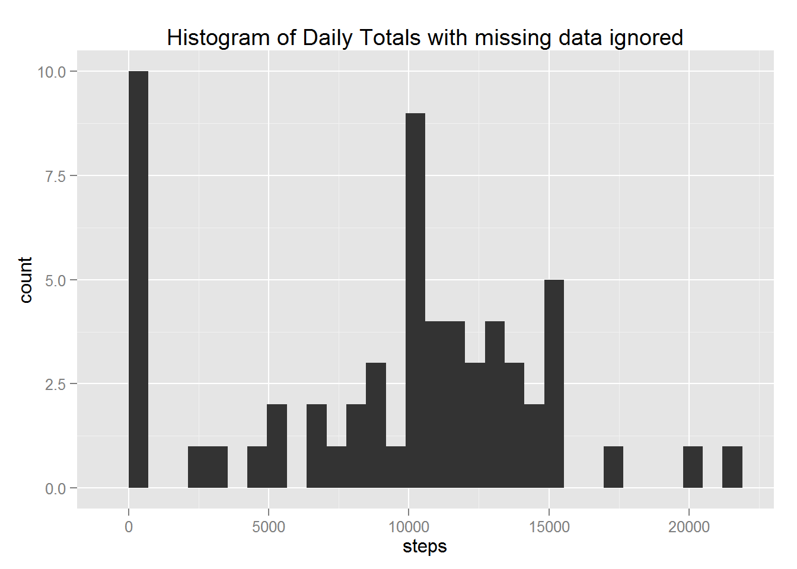
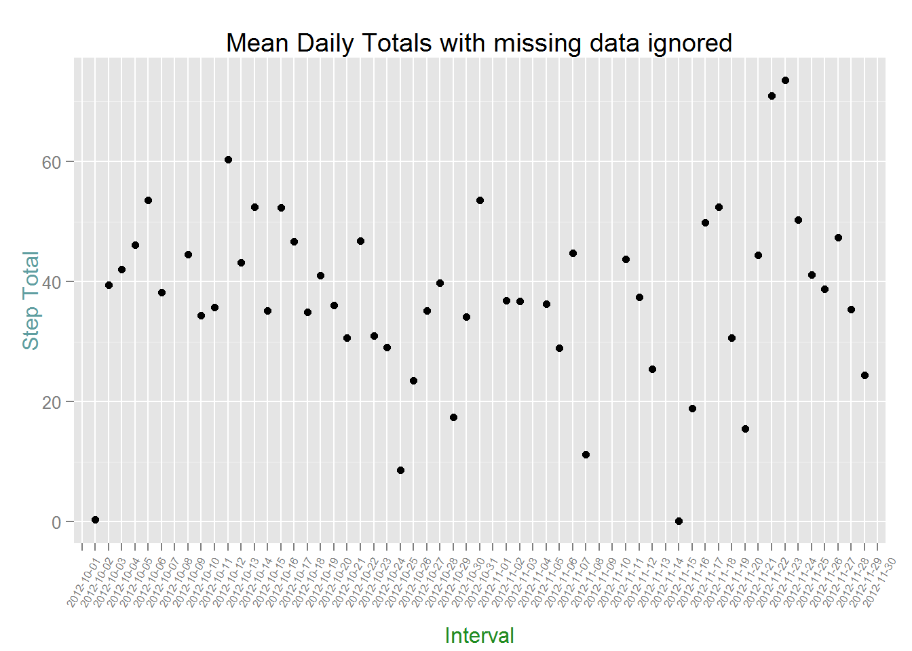
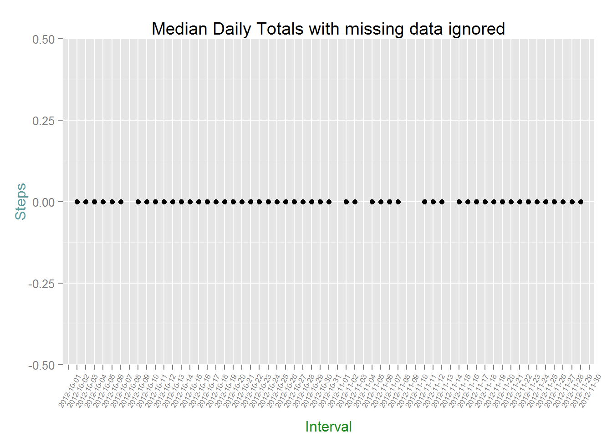
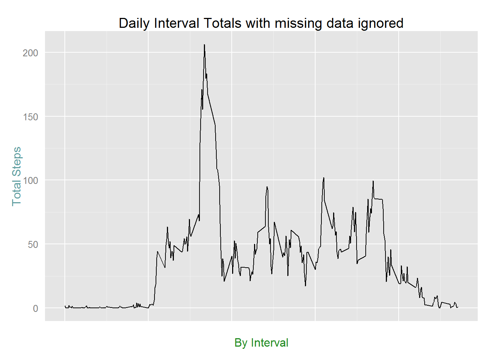
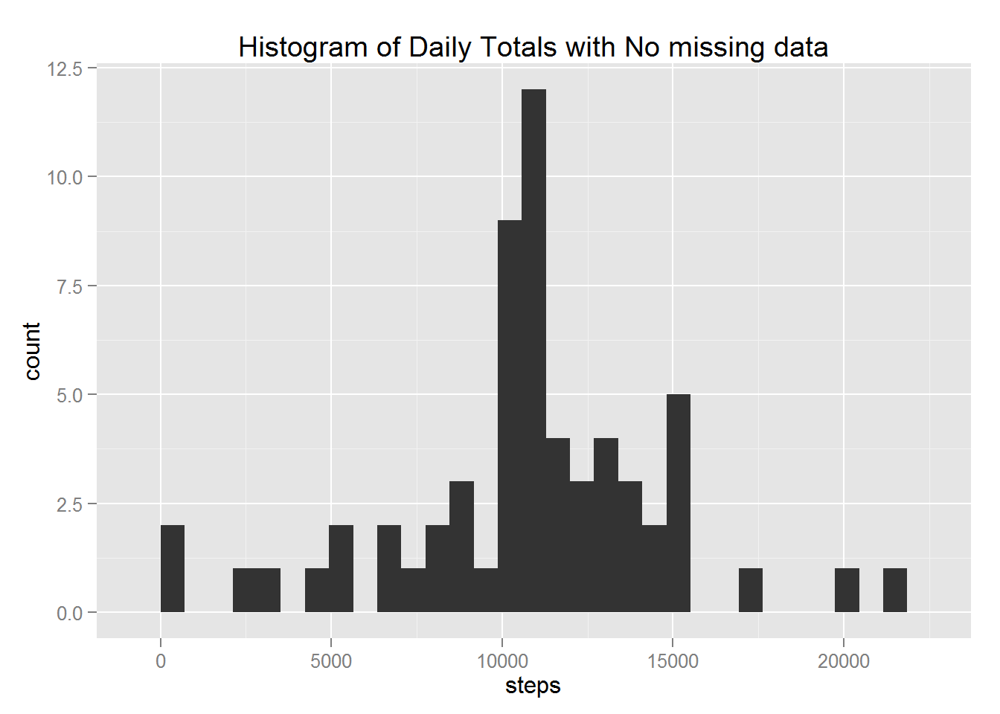
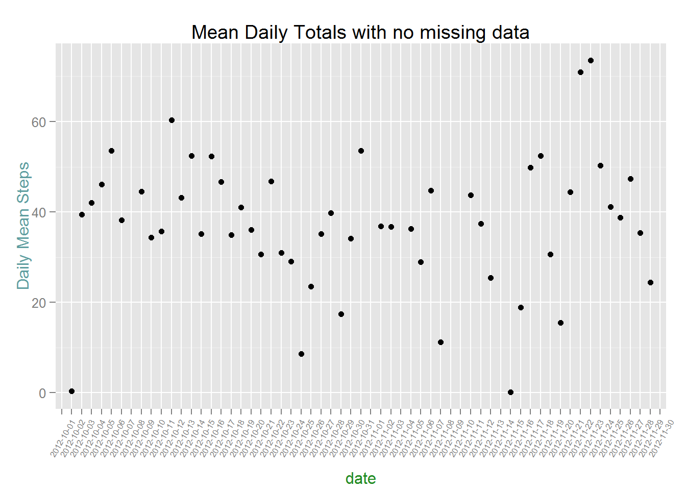
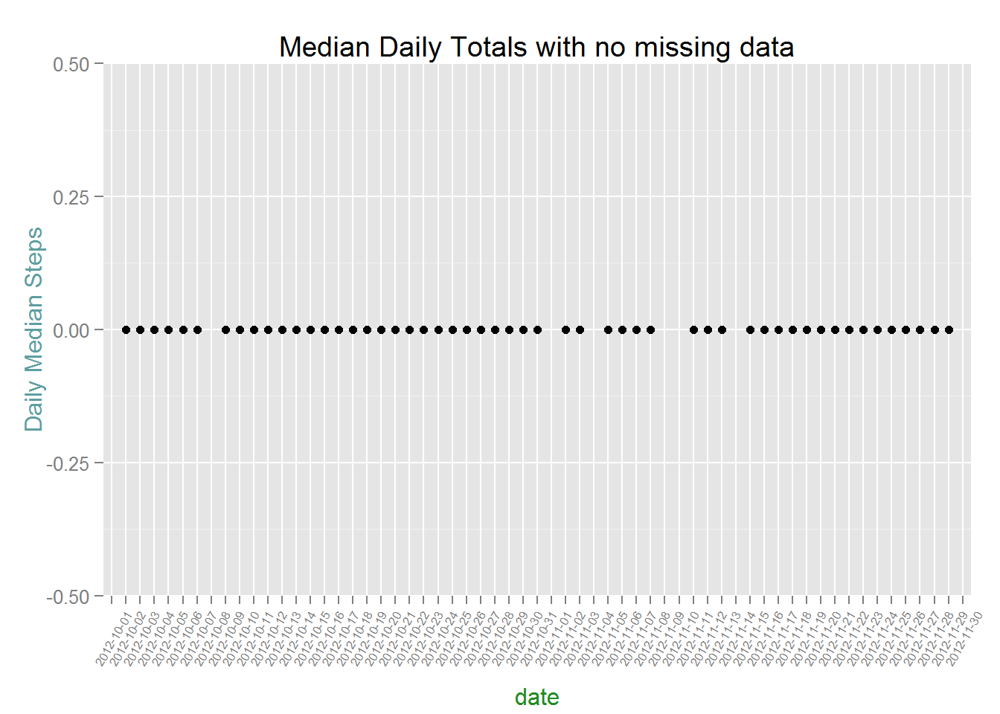
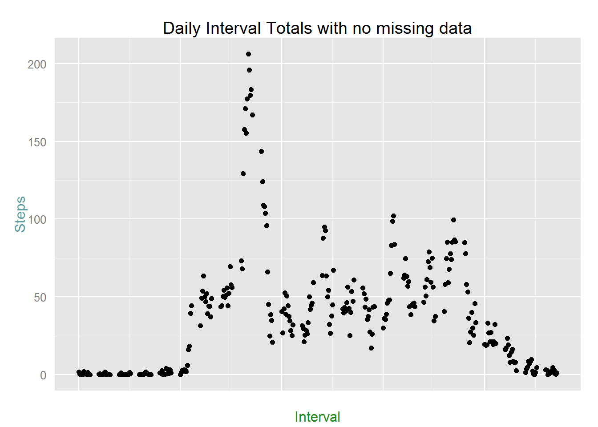
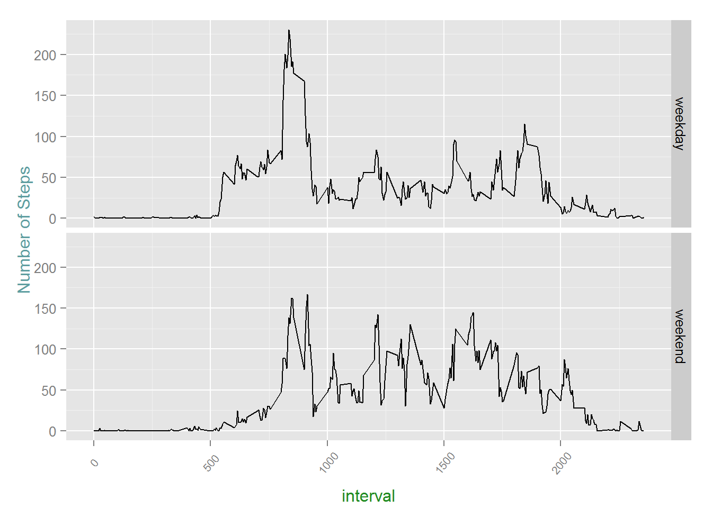

###Project Description  

Sign into GitHub using my credentials

fork https://GithUb.com/rdpeng/RepData_PeerAssessment1 to my account

https://github.com/NelsonBrown/RepData_PeerAssessment1

Create local repository for the project

mkdir "c\\Coursera\\Repdata_PeerAssessment1"

git remote https://github.com/NelsonBrown/RepData_PeerAssessment1

Open new file PA1_Template.Rmd in RStudio

Set working Directory to local repository directory


```r
setwd("C:/Coursera/RepData_PeerAssessment1")
```

Extract activity.zip to current directory creating activity.csv  

Read activity.csv into activity data frame


```r
activity <- read.csv("activity.csv")
summary(activity)  
```

```
##      steps               date          interval   
##  Min.   :  0.0   2012-10-01:  288   Min.   :   0  
##  1st Qu.:  0.0   2012-10-02:  288   1st Qu.: 589  
##  Median :  0.0   2012-10-03:  288   Median :1178  
##  Mean   : 37.4   2012-10-04:  288   Mean   :1178  
##  3rd Qu.: 12.0   2012-10-05:  288   3rd Qu.:1766  
##  Max.   :806.0   2012-10-06:  288   Max.   :2355  
##  NA's   :2304    (Other)   :15840
```

###As we can see from the summary there are 2304 step values missing

Load ggplot2 library


```r
library(ggplot2)
```

Plot histogram of daily activity steps removing the missing data


```r
dailySteps <- aggregate(activity$steps, by=list(date=activity$date), FUN=sum, na.rm=TRUE)
colnames(dailySteps)[2] <- "steps"
qplot(steps, data = dailySteps, geom = "histogram", main = "Histogram of Daily Totals with missing data ignored", )
```

```
## stat_bin: binwidth defaulted to range/30. Use 'binwidth = x' to adjust this.
```



Calculate and plot Daily mean totals of steps removing the missing data
  

```r
dailyMeanSteps <- aggregate(activity$steps, by=list(date=activity$date), FUN=mean, na.rm=TRUE)

colnames(dailyMeanSteps)[2] <- "steps"


p <- qplot(date, steps, data = dailyMeanSteps, main = "Mean Daily Totals with missing data ignored", geom = c("point"), method = "lm", ylab="Step Total", xlab="Interval" )

p1 <- p + theme(
        axis.title.x = element_text(color="forestgreen", vjust=-0.35),
        axis.title.y = element_text(color="cadetblue" , vjust=0.35),   
        axis.text.x=element_text(angle=60, size=6, vjust=0.5)
)

p1
```

```
## Warning: Removed 8 rows containing missing values (geom_point).
```



Calculate and plot Daily Median totals of steps removing the missing data
  

```r
dailyMedianSteps <- aggregate(activity$steps, by=list(date=activity$date), FUN=median, na.rm=TRUE)

colnames(dailyMedianSteps)[2] <- "steps"

p <- qplot(date, steps, data =dailyMedianSteps, main = "Median Daily Totals with missing data ignored", geom = "point", ylab="Steps", xlab="Interval")

p1 <- p + theme(
        axis.title.x = element_text(color="forestgreen", vjust=-0.35),
        axis.title.y = element_text(color="cadetblue" , vjust=0.35),   
        axis.text.x=element_text(angle=60, size=6, vjust=0.5)
)

p1
```

```
## Warning: Removed 8 rows containing missing values (geom_point).
```



Calculate the average steps per interval period removing the missing data


```r
intervalSteps <- aggregate(activity$steps, by=list(interval=activity$interval), FUN=mean, na.rm=TRUE)

colnames(intervalSteps)[2] <- "steps"

 p <- qplot(interval, label = NULL, steps, data = intervalSteps, geom = "line", type = "1", main = "Daily Interval Totals with missing data ignored", ylab="Total Steps", xlab="By Interval")
 
 p1 <- p + theme(
          axis.ticks = element_blank(),
          axis.text.x = element_blank(),
          axis.title.x = element_text(color="forestgreen", vjust=-0.35),
          axis.title.y = element_text(color="cadetblue" , vjust=0.35),   
          axis.text.x=element_text(angle=60, size=6, vjust=0.5)
  )
 p1
```



Fill in missing values with the mean steps value for a given interval  


```r
require(plyr)
require(Hmisc)

newactivity <- ddply(activity, "interval", mutate, steps = impute(steps, mean))

newactivity <- newactivity[order(newactivity$date,newactivity$interval),]
summary(newactivity)
```

```
## 
##  8 values imputed to 1.717
```

```
##      steps               date          interval   
##  Min.   :  0.0   2012-10-01:  288   Min.   :   0  
##  1st Qu.:  0.0   2012-10-02:  288   1st Qu.: 589  
##  Median :  0.0   2012-10-03:  288   Median :1178  
##  Mean   : 37.4   2012-10-04:  288   Mean   :1178  
##  3rd Qu.: 27.0   2012-10-05:  288   3rd Qu.:1766  
##  Max.   :806.0   2012-10-06:  288   Max.   :2355  
##                  (Other)   :15840
```

Make the date value a factor


```r
newactivity$date <- as.factor(newactivity$date)
```

Plot histogram of daily activity steps with missing data filled in with generated data


```r
dailySteps <- aggregate(newactivity$steps, by=list(date=newactivity$date), FUN=sum)

colnames(dailySteps)[2] <- "steps"

qplot(steps, data = dailySteps, geom = "histogram", main = "Histogram of Daily Totals with No missing data", )
```

```
## stat_bin: binwidth defaulted to range/30. Use 'binwidth = x' to adjust this.
```



Calculate and plot mean daily totals of steps with the missing data filled in 


```r
dailyMeanSteps <- aggregate(activity$steps, by=list(date=activity$date), FUN=mean)

colnames(dailyMeanSteps)[2] <- "steps"


p <- qplot(date, steps, data = dailyMeanSteps, main = "Mean Daily Totals with no missing data", geom = "point", method = "lm", ylab="Daily Mean Steps", )

p1 <- p + theme(
        axis.title.x = element_text(color="forestgreen", vjust=-0.35),
        axis.title.y = element_text(color="cadetblue" , vjust=0.35),   
        axis.text.x=element_text(angle=60, size=6, vjust=0.5)
)

p1
```

```
## Warning: Removed 8 rows containing missing values (geom_point).
```




Calculate and plot median daily totals of steps with the missing data filled in 


```r
 dailySMedianteps <- aggregate(newactivity$steps, by=list(date=newactivity$date), FUN=median)
 
 colnames(dailyMedianSteps)[2] <- "steps"
 
 p <- qplot(date, steps, data = dailyMedianSteps, main = "Median Daily Totals with no missing data", geom = "point", method = "lm", ylab="Daily Median Steps", )
 
 p1 <- p + theme(
         axis.title.x = element_text(color="forestgreen", vjust=-0.35),
         axis.title.y = element_text(color="cadetblue" , vjust=0.35),   
         axis.text.x=element_text(angle=60, size=6, vjust=0.5)
 )
 p1
```

```
## Warning: Removed 8 rows containing missing values (geom_point).
```



Calculate interval steps mean with the missing data filled in


```r
intervalSteps <- aggregate(newactivity$steps, by=list(interval=newactivity$interval), FUN=mean)

colnames(intervalSteps)[2] <- "steps"

 p <- qplot(interval, label = NULL, steps, data = intervalSteps, geom + "line", type = "1", ylab="Steps", main = "Daily Interval Totals with no missing data", xlab="Interval", )
 
 p1 <- p + theme(
          axis.ticks = element_blank(),
          axis.text.x = element_blank(),
          axis.title.x = element_text(color="forestgreen", vjust=-0.35),
          axis.title.y = element_text(color="cadetblue" , vjust=0.35),   
          axis.text.x=element_text(angle=60, size=6, vjust=0.5)
  )
 p1
```



Add a column to the data frame specifying the day of the week
 Monday thru Sunday
 Convert Monday thru Friday to weekpart == "weekday"
 Convert Saturday and Sunday to "Weekend"


```r
newactivity$weekpart <- weekdays(as.Date(newactivity$date))
head(newactivity)
```

```
##       steps       date interval weekpart
## 1   1.71698 2012-10-01        0   Monday
## 62  0.33962 2012-10-01        5   Monday
## 123 0.13208 2012-10-01       10   Monday
## 184 0.15094 2012-10-01       15   Monday
## 245 0.07547 2012-10-01       20   Monday
## 306 2.09434 2012-10-01       25   Monday
```

```r
newactivity$weekpart[newactivity$weekpart=="Monday"] <- "weekday"
newactivity$weekpart[newactivity$weekpart=="Tuesday"] <- "weekday"
newactivity$weekpart[newactivity$weekpart=="Wednesday"] <- "weekday"
newactivity$weekpart[newactivity$weekpart=="Thursday"] <- "weekday"
newactivity$weekpart[newactivity$weekpart=="Friday"] <- "weekday"
newactivity$weekpart[newactivity$weekpart=="Saturday"] <- "weekend"
newactivity$weekpart[newactivity$weekpart=="Sunday"] <- "weekend"
newactivity$weekpart <- as.factor(newactivity$weekpart)
head(newactivity,10)
```

```
##       steps       date interval weekpart
## 1   1.71698 2012-10-01        0  weekday
## 62  0.33962 2012-10-01        5  weekday
## 123 0.13208 2012-10-01       10  weekday
## 184 0.15094 2012-10-01       15  weekday
## 245 0.07547 2012-10-01       20  weekday
## 306 2.09434 2012-10-01       25  weekday
## 367 0.52830 2012-10-01       30  weekday
## 428 0.86792 2012-10-01       35  weekday
## 489 0.00000 2012-10-01       40  weekday
## 550 1.47170 2012-10-01       45  weekday
```

Plot the Weekend vs weekday activity


```r
par(mfrow = c(2,1),mfcol=c(2,1))

weekSteps <- aggregate(steps ~ interval + weekpart, newactivity, mean)

p <- qplot(interval, steps, data = weekSteps, ylab="Number of Steps", geom = "line", type ="l", facets = weekpart ~ .)
p1 <- p + theme(
                axis.title.x = element_text(color="forestgreen", vjust=-0.35),
                axis.title.y = element_text(color="cadetblue" , vjust=0.35),   
                axis.text.x=element_text(angle=50, size=8, vjust=0.5)
                )
p1
```


load knitr library and invoke knit2html() to create md and html files 


